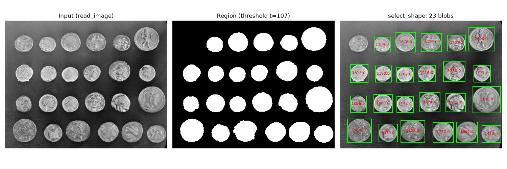

# halcon-prep
Blob inspection pipeline in Python, mapped to HALCON operators
# Machine Vision Prep — Blob Inspection

Python implementation of a classic HALCON blob analysis pipeline,
built to understand region-based machine vision concepts.

**Pipeline:** read_image → threshold → connection → select_shape → measure

- Each step is commented with its HALCON operator equivalent
- Found and fixed a merged-blob problem (uneven background) using
  border clearing + area filtering; local/adaptive threshold as root-cause fix

*Stack: NumPy, scikit-image, Matplotlib*
